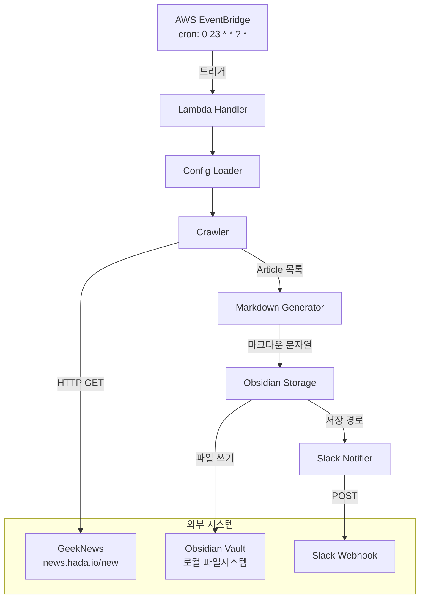
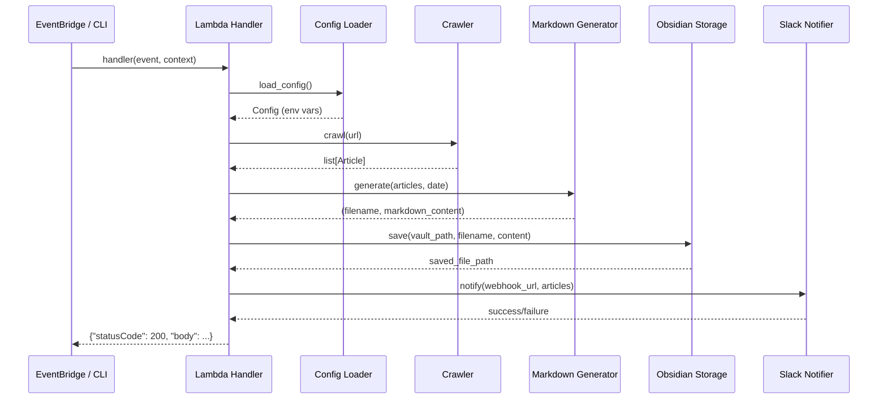

# 설계 문서: GeekNews Daily Pipeline

## 개요

GeekNews Daily Pipeline은 GeekNews(`https://news.hada.io/new`) 최신 글을 매일 자동으로 크롤링하여 IT 기사 정보를 수집하고, Obsidian 마크다운 파일로 정리한 뒤 Slack으로 요약 알림을 보내는 자동화 파이프라인이다.

시스템은 AWS Lambda(Python)로 배포되며, EventBridge 스케줄을 통해 매일 KST 오전 8시에 트리거된다. 로컬 테스트를 위한 `__main__` 블록과 배포 패키징 스크립트를 함께 제공한다.

핵심 설계 원칙:
- 각 모듈(Crawler, Markdown Generator, Obsidian Storage, Slack Notifier)은 독립적으로 테스트 가능한 단위로 분리
- 실패 허용(graceful degradation): 개별 단계 실패가 전체 파이프라인을 중단시키지 않음
- 환경 변수 기반 설정으로 로컬/Lambda 환경 모두 지원

## 아키텍처

### High-Level Architecture



### Low-Level Architecture: 모듈 간 데이터 흐름



## 컴포넌트 및 인터페이스

### 프로젝트 구조

```
geeknews-daily-pipeline/
├── src/
│   ├── __init__.py
│   ├── handler.py          # Lambda 핸들러 + __main__
│   ├── crawler.py           # GeekNews 크롤러
│   ├── markdown_generator.py # 마크다운 변환
│   ├── obsidian_storage.py  # Obsidian Vault 저장
│   ├── slack_notifier.py    # Slack 알림
│   └── config.py            # 환경 변수 로더
├── tests/
│   ├── __init__.py
│   ├── test_crawler.py
│   ├── test_markdown_generator.py
│   ├── test_obsidian_storage.py
│   ├── test_slack_notifier.py
│   ├── test_config.py
│   └── test_handler.py
├── scripts/
│   └── package.sh           # Lambda 배포 패키징
├── requirements.txt
├── requirements-dev.txt
├── .env.example
└── README.md
```

### 컴포넌트 상세

#### 1. Config Loader (`src/config.py`)

환경 변수를 로드하고 검증하는 모듈.

```python
@dataclass
class Config:
    slack_webhook_url: str
    obsidian_vault_path: str
    geeknews_url: str  # 기본값: "https://news.hada.io/new"

def load_config() -> Config:
    """
    .env 파일(존재 시)과 시스템 환경 변수에서 설정을 로드한다.
    시스템 환경 변수가 .env보다 우선한다.
    필수 변수 누락 시 ValueError를 발생시킨다.
    """
    ...
```

#### 2. Crawler (`src/crawler.py`)

GeekNews 페이지를 HTTP로 가져와 BeautifulSoup으로 파싱하는 모듈.

```python
@dataclass
class Article:
    title: str
    original_url: str
    summary: str | None
    crawled_at: str  # ISO 8601 UTC

def crawl(url: str) -> list[Article]:
    """
    GeekNews 최신 글 페이지를 크롤링하여 Article 목록을 반환한다.
    접근 불가 시 빈 리스트를 반환한다.
    파싱 실패한 개별 항목은 건너뛴다.
    """
    ...
```

파싱 전략 (steering 가이드 기반):
- `div.topics > div.topic_row`로 각 포스팅 선택
- `div.topictitle h1`에서 제목 추출
- `div.topictitle > a[rel=nofollow]`의 `href`에서 원본 링크 추출
- `div.topicdesc a`에서 요약 추출 (없을 수 있음 → `None`)
- `html.unescape()`로 HTML 엔티티 처리

#### 3. Markdown Generator (`src/markdown_generator.py`)

Article 목록을 Obsidian 호환 마크다운으로 변환하는 모듈.

```python
def generate_markdown(articles: list[Article], date: str) -> tuple[str, str]:
    """
    Article 목록을 마크다운 문자열로 변환한다.
    Returns: (filename, markdown_content)
    filename 형식: "YYYY-MM-DD-geeknews.md"
    """
    ...

def parse_markdown(content: str) -> list[dict]:
    """
    마크다운 문자열을 파싱하여 기사 정보 딕셔너리 목록을 반환한다.
    라운드트립 검증용.
    """
    ...
```

마크다운 출력 형식:
```markdown
# GeekNews Daily - 2024-01-15

## 기사 제목 1

- 🔗 원본 링크: [링크 텍스트](https://example.com/article)
- 📝 요약: 기사 요약 텍스트

---

## 기사 제목 2

- 🔗 원본 링크: [링크 텍스트](https://example.com/article2)
- 📝 요약: 요약 없음

---
```

#### 4. Obsidian Storage (`src/obsidian_storage.py`)

마크다운 파일을 Obsidian Vault에 저장하는 모듈.

```python
def save_to_vault(vault_path: str, filename: str, content: str) -> str:
    """
    마크다운 파일을 Obsidian Vault 경로에 저장한다.
    동일 파일 존재 시 덮어쓴다.
    Returns: 저장된 파일의 전체 경로
    Raises: FileNotFoundError (vault_path 미존재 시)
    """
    ...
```

#### 5. Slack Notifier (`src/slack_notifier.py`)

Slack Webhook을 통해 기사 요약을 전송하는 모듈.

```python
def notify(webhook_url: str, articles: list[Article]) -> bool:
    """
    Slack 채널로 기사 요약 메시지를 전송한다.
    빈 목록일 경우 "새로운 기사가 없습니다" 메시지를 전송한다.
    실패 시 False를 반환하고 로깅한다 (예외를 발생시키지 않음).
    """
    ...
```

Slack 메시지 형식 (Block Kit):
```json
{
  "blocks": [
    {
      "type": "header",
      "text": {"type": "plain_text", "text": "📰 GeekNews Daily - 2024-01-15"}
    },
    {
      "type": "section",
      "text": {"type": "mrkdwn", "text": "• <https://example.com|기사 제목 1>\n• <https://example.com|기사 제목 2>"}
    }
  ]
}
```

#### 6. Lambda Handler (`src/handler.py`)

파이프라인 전체를 오케스트레이션하는 진입점.

```python
def handler(event: dict, context) -> dict:
    """
    AWS Lambda 핸들러. 파이프라인을 순서대로 실행한다.
    Returns: {"statusCode": 200/500, "body": ...}
    """
    ...

if __name__ == "__main__":
    # 로컬 테스트용: python -m src.handler
    ...
```

#### 7. Package Script (`scripts/package.sh`)

Lambda 배포용 ZIP 패키지를 생성하는 셸 스크립트.

```bash
#!/bin/bash
# 1. 임시 디렉토리에 의존성 설치
# 2. src/ 코드 복사
# 3. .env, __pycache__, tests/ 제외
# 4. ZIP 생성 후 경로와 크기 출력
```

## 데이터 모델

### Article

| 필드 | 타입 | 설명 | 필수 |
|------|------|------|------|
| `title` | `str` | 기사 제목 | ✅ |
| `original_url` | `str` | 원본 기사 URL | ✅ |
| `summary` | `str \| None` | 기사 요약 텍스트 | ❌ |
| `crawled_at` | `str` | 수집 일시 (ISO 8601 UTC) | ✅ |

### Config

| 필드 | 타입 | 환경 변수 | 기본값 |
|------|------|-----------|--------|
| `slack_webhook_url` | `str` | `SLACK_WEBHOOK_URL` | 없음 (필수) |
| `obsidian_vault_path` | `str` | `OBSIDIAN_VAULT_PATH` | 없음 (필수) |
| `geeknews_url` | `str` | `GEEKNEWS_URL` | `https://news.hada.io/new` |

### Lambda Handler 응답

```python
# 성공
{"statusCode": 200, "body": {"articles_count": 20, "saved_path": "/vault/2024-01-15-geeknews.md"}}

# 실패
{"statusCode": 500, "body": {"error": "에러 메시지"}}
```

### 의존성

| 패키지 | 용도 |
|--------|------|
| `requests` | HTTP 요청 (크롤링, Slack Webhook) |
| `beautifulsoup4` | HTML 파싱 |
| `python-dotenv` | `.env` 파일 로드 |

개발 의존성:

| 패키지 | 용도 |
|--------|------|
| `pytest` | 테스트 프레임워크 |
| `hypothesis` | 속성 기반 테스트 |
| `responses` | HTTP 요청 모킹 |


## 정확성 속성 (Correctness Properties)

*속성(Property)이란 시스템의 모든 유효한 실행에서 참이어야 하는 특성 또는 동작을 말한다. 속성은 사람이 읽을 수 있는 명세와 기계가 검증할 수 있는 정확성 보장 사이의 다리 역할을 한다.*

### Property 1: HTML 파싱 시 모든 Article 필드 추출

*For any* 유효한 GeekNews HTML(하나 이상의 `topic_row`를 포함)에 대해, Crawler가 반환하는 각 Article은 비어있지 않은 `title`, 유효한 URL인 `original_url`, `str | None` 타입의 `summary`, 그리고 유효한 ISO 8601 UTC 형식의 `crawled_at`을 포함해야 한다.

**Validates: Requirements 1.2, 1.5**

### Property 2: 부분 파싱 실패 시 유효한 Article만 반환

*For any* 유효한 `topic_row`와 비정상적인 `topic_row`가 혼합된 HTML에 대해, Crawler는 정확히 유효한 `topic_row` 수만큼의 Article을 반환해야 하며, 비정상 항목은 건너뛰어야 한다.

**Validates: Requirements 1.4**

### Property 3: 마크다운 파일명 형식

*For any* 유효한 날짜 문자열에 대해, Markdown Generator가 생성하는 파일명은 `YYYY-MM-DD-geeknews.md` 패턴과 정확히 일치해야 한다.

**Validates: Requirements 2.3**

### Property 4: 마크다운 라운드트립

*For any* 유효한 Article 목록에 대해, `generate_markdown`으로 마크다운을 생성한 뒤 `parse_markdown`으로 다시 파싱하면, 원본 Article 목록과 동일한 제목, 원본 링크, 요약 정보를 포함해야 한다.

**Validates: Requirements 2.4**

### Property 5: 파일 저장 라운드트립

*For any* 유효한 vault 경로, 파일명, 마크다운 콘텐츠에 대해, `save_to_vault`가 반환한 경로에서 파일을 읽으면 원본 콘텐츠와 동일해야 한다.

**Validates: Requirements 3.1, 3.4**

### Property 6: 파일 저장 멱등성 (덮어쓰기)

*For any* 유효한 vault 경로와 파일명에 대해, 서로 다른 콘텐츠로 두 번 저장하면 두 번째 콘텐츠만 파일에 존재해야 한다.

**Validates: Requirements 3.2**

### Property 7: Slack 메시지에 모든 기사 제목과 링크 포함

*For any* 비어있지 않은 Article 목록에 대해, Slack Notifier가 구성하는 메시지 본문에는 모든 Article의 `title`과 `original_url`이 포함되어야 한다.

**Validates: Requirements 4.2**

### Property 8: Config에서 지원하는 환경 변수 로드

*For any* `SLACK_WEBHOOK_URL`, `OBSIDIAN_VAULT_PATH`, `GEEKNEWS_URL` 값의 조합에 대해, 해당 값들이 환경에 설정되어 있으면 `load_config()`가 반환하는 Config 객체의 각 필드가 설정된 값과 일치해야 한다.

**Validates: Requirements 5.2**

### Property 9: 필수 환경 변수 누락 시 에러 메시지에 변수명 포함

*For any* 필수 환경 변수(`SLACK_WEBHOOK_URL`, `OBSIDIAN_VAULT_PATH`) 중 하나 이상이 누락된 경우, `load_config()`가 발생시키는 에러 메시지에는 누락된 변수명이 포함되어야 한다.

**Validates: Requirements 5.3**

### Property 10: 시스템 환경 변수가 .env 파일보다 우선

*For any* 환경 변수 키에 대해, 시스템 환경 변수와 `.env` 파일 모두에 값이 설정된 경우, `load_config()`는 시스템 환경 변수의 값을 사용해야 한다.

**Validates: Requirements 5.4**

### Property 11: 파이프라인 에러 시 실패 상태 반환

*For any* 파이프라인 컴포넌트(Crawler, Markdown Generator, Obsidian Storage)에서 발생하는 예외에 대해, Lambda Handler는 예외를 잡아 로깅하고 `statusCode: 500`을 포함하는 응답을 반환해야 한다.

**Validates: Requirements 6.5**

### Property 12: ZIP 패키지에서 금지 파일 제외

*For any* 생성된 Lambda 배포 ZIP 파일에 대해, `.env`, `__pycache__/`, 테스트 파일(`test_*.py`)이 포함되어 있지 않아야 한다.

**Validates: Requirements 7.3**

## 에러 처리

### 에러 처리 전략

파이프라인은 **단계별 격리(stage isolation)** 전략을 사용한다. 각 단계의 에러는 해당 단계에서 처리되며, 가능한 한 다음 단계로 진행한다.

| 단계 | 에러 유형 | 처리 방식 | 파이프라인 영향 |
|------|-----------|-----------|----------------|
| Crawler | HTTP 요청 실패 (timeout, 4xx, 5xx) | 로깅 후 빈 리스트 반환 | 계속 (빈 마크다운 생성) |
| Crawler | HTML 파싱 실패 (개별 항목) | 로깅 후 해당 항목 건너뜀 | 계속 (부분 결과) |
| Markdown Generator | 빈 Article 목록 | 빈 마크다운 파일 생성 | 계속 |
| Obsidian Storage | Vault 경로 미존재 | `FileNotFoundError` 로깅 | **중단** (저장 실패) |
| Obsidian Storage | 파일 쓰기 권한 없음 | `PermissionError` 로깅 | **중단** |
| Slack Notifier | Webhook 전송 실패 | 로깅 후 `False` 반환 | 계속 (알림만 실패) |
| Config Loader | 필수 환경 변수 누락 | `ValueError` 발생 | **중단** (시작 불가) |
| Lambda Handler | 미처리 예외 | 로깅 후 500 응답 반환 | 종료 |

### 로깅

- Python 표준 `logging` 모듈 사용
- Lambda 환경에서는 CloudWatch Logs로 자동 전송
- 로그 레벨: `INFO` (정상 흐름), `WARNING` (부분 실패), `ERROR` (단계 실패)

```python
import logging
logger = logging.getLogger(__name__)
logger.setLevel(logging.INFO)
```

## 테스트 전략

### 이중 테스트 접근법

이 프로젝트는 **단위 테스트**와 **속성 기반 테스트(Property-Based Testing)** 를 병행한다.

- **단위 테스트**: 구체적인 예시, 엣지 케이스, 에러 조건 검증
- **속성 기반 테스트**: 모든 유효한 입력에 대해 보편적 속성 검증
- 두 방식은 상호 보완적이며, 함께 사용하여 포괄적인 커버리지를 달성한다

### 속성 기반 테스트 설정

- **라이브러리**: `hypothesis` (Python PBT 표준 라이브러리)
- **최소 반복 횟수**: 각 속성 테스트당 100회 이상
- **태그 형식**: `# Feature: geeknews-daily-pipeline, Property {번호}: {속성 설명}`
- 각 정확성 속성은 **하나의 속성 기반 테스트**로 구현한다

### 테스트 매핑

| 속성 | 테스트 유형 | 테스트 파일 |
|------|------------|------------|
| Property 1: HTML 파싱 필드 추출 | PBT | `test_crawler.py` |
| Property 2: 부분 파싱 실패 처리 | PBT | `test_crawler.py` |
| Property 3: 파일명 형식 | PBT | `test_markdown_generator.py` |
| Property 4: 마크다운 라운드트립 | PBT | `test_markdown_generator.py` |
| Property 5: 파일 저장 라운드트립 | PBT | `test_obsidian_storage.py` |
| Property 6: 파일 저장 멱등성 | PBT | `test_obsidian_storage.py` |
| Property 7: Slack 메시지 내용 | PBT | `test_slack_notifier.py` |
| Property 8: 환경 변수 로드 | PBT | `test_config.py` |
| Property 9: 누락 변수 에러 | PBT | `test_config.py` |
| Property 10: 환경 변수 우선순위 | PBT | `test_config.py` |
| Property 11: 에러 시 실패 응답 | PBT | `test_handler.py` |
| Property 12: ZIP 금지 파일 제외 | PBT | `test_package.py` |

### 단위 테스트 범위

단위 테스트는 속성 기반 테스트로 커버하기 어려운 구체적 시나리오에 집중한다:

- **Crawler**: 실제 GeekNews HTML 스냅샷으로 파싱 검증, HTTP 에러 시나리오 (404, 500, timeout)
- **Markdown Generator**: 빈 Article 목록 처리, 요약이 None인 Article 포맷
- **Obsidian Storage**: 존재하지 않는 vault 경로 에러, 파일 권한 에러
- **Slack Notifier**: 빈 목록 시 "새로운 기사가 없습니다" 메시지, Webhook 실패 시 False 반환
- **Config Loader**: `.env` 파일 없이 시스템 환경 변수만으로 동작
- **Lambda Handler**: 정상 파이프라인 실행 흐름 (모킹), 로컬 실행 모드

### Hypothesis 전략 예시

```python
from hypothesis import given, settings, strategies as st

# Article 생성 전략
article_strategy = st.builds(
    Article,
    title=st.text(min_size=1, max_size=200),
    original_url=st.from_regex(r"https://[a-z]+\.[a-z]+/[a-z0-9]+", fullmatch=True),
    summary=st.one_of(st.none(), st.text(min_size=1, max_size=500)),
    crawled_at=st.datetimes().map(lambda dt: dt.isoformat() + "Z"),
)

# Feature: geeknews-daily-pipeline, Property 4: 마크다운 라운드트립
@given(articles=st.lists(article_strategy, min_size=1, max_size=30))
@settings(max_examples=100)
def test_markdown_round_trip(articles):
    date = "2024-01-15"
    filename, content = generate_markdown(articles, date)
    parsed = parse_markdown(content)
    for original, restored in zip(articles, parsed):
        assert original.title == restored["title"]
        assert original.original_url == restored["original_url"]
        assert original.summary == restored["summary"]
```
